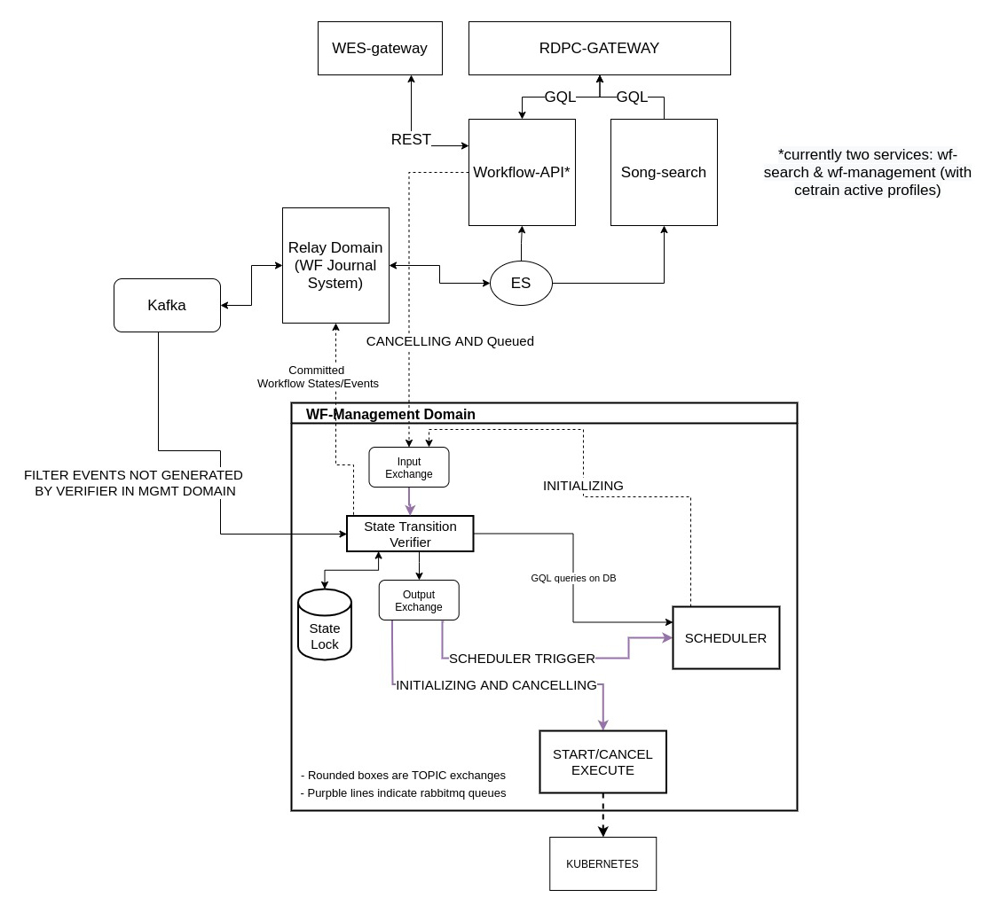
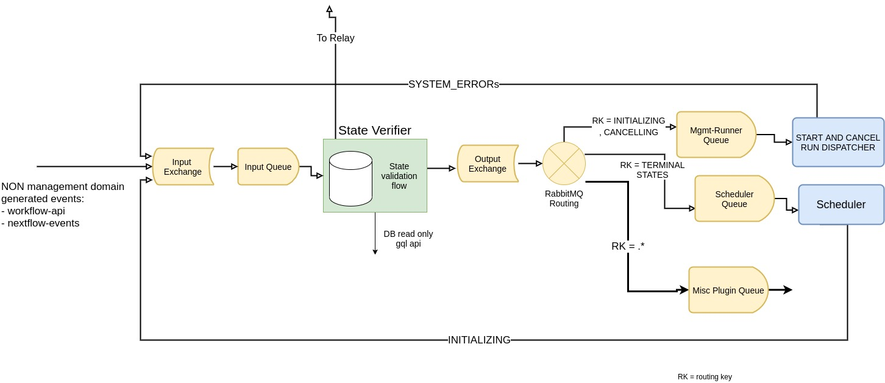
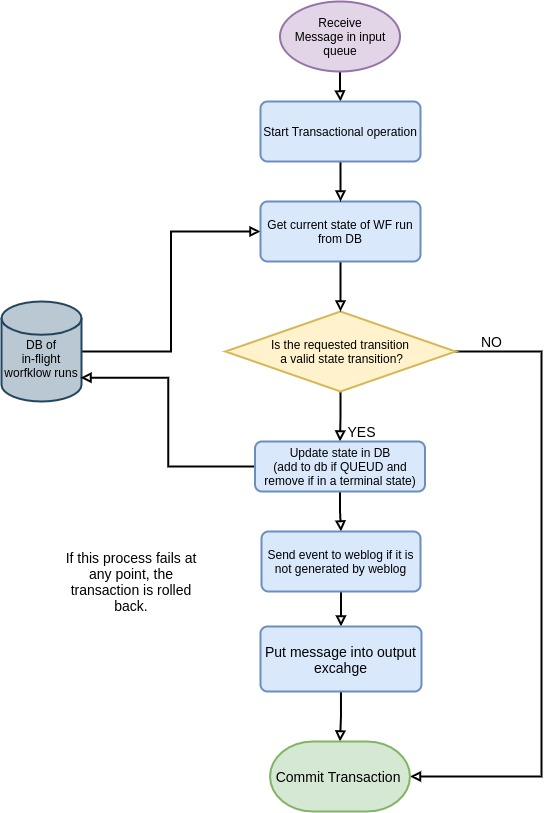

# Workflow Management

[](https://www.gnu.org/licenses/agpl-3.0)

This service is responsible for managing the lifecycle of a workflow execution within the larger Workflow Execution System (WES).
At it's simplest, Workflow Management takes a workflow request and initiates a run using the requested workflow engine (currently only supporting Nextflow).
However, it is possible to configure Workflow Management to go beyond being a direct initiator and instead it can be configured to queue runs
which can then be processed by various "middleware" before finally hitting the initiator, more on this below. In addition to queuing and initiating,
Workflow Management also handles cancelling runs and ensuring that run state transitions are valid (ie. a late received duplicate message to cancel a run
will be ignored as the run is already in a state of `CANCELLING` or `CANCELLED` at that point)

Workflow Management is part of the larger Workflow Execution Service which comprises multiple services. Given that Workflow Management is composed itself of
potentially multiple instances running different components (managed with Spring profiles) and potentially multiple middleware services, we refer to this more
broadly as the Workflow Management Domain.



The above diagram illustrates the Workflow Management domain, and it's position in the overall WES service architecture. This README will attempt to illuminate
the main concepts employed by Workflow Management as well as summarize the technologies used and how to get up and running with it as smoothly as possible.

## Tech Stack
- Java 11
- RabbitMQ 3.X
- PostgreSQL 13
- [Spring Reactive Stack](https://docs.spring.io/spring-framework/docs/current/reference/html/web-reactive.html)
- [Reactor RabbitMQ Streams](https://pivotal.github.io/reactor-rabbitmq-streams/docs/current/)
- [Apache Avro](https://avro.apache.org/)

## Workflow Run Lifecycle and State Diagram

Workflow runs can be in a number of states as they make their way through the WES, these states can be updated by user-action (starting, cancelling),
by events in the Workflow Management domain (going from queued to initiating, cancelling to cancelled, etc), and from external events from the workflow
execution engine itself (Nextflow at the present time).


### High Level Flow (RabbitMQ Queues and How They Work)

Communication between the services in the management domain will be backed by RabbitMQ. This is because these messages don't need to be stored permanently,
we have selective message acknowledgement, once delivery, and clear transaction support. Messages in the RabbitMQ flow will also not pollute the journal in
the workflow-relay domain, ensuring separation of concerns.



In addition to the separation of concerns between decision-making (transitioning states) and journaling, this approach is especially beneficial to expanding
on the functionality of the Management domain with "middleware services", something that is explained in greater detail further down this readme.

To keep things orderly and sane, Management has a single message schema defined in using Apache AVRO, that it and all future middleware must use in order to
pass messages, a Lingua Franca of sorts.

##### Workflow Management Message Schema

```
WorkflowManagementMessage {
    @NonNull String runId;
    @NonNull WorkflowState state;
    @NonNull String workflowUrl;
    @NonNull String utcTime;
    String workflowType;
    String workflowTypeVersion;
    Map<String, Object> workflowParams;
    EngineParameters workflowEngineParams;
}

EngineParameters {
    String defaultContainer;
    String launchDir;
    String projectDir;
    String workDir;
    String revision;
    String resume;
    String latest;
}

enum WorkflowState {
    UNKNOWN("UNKNOWN"),
    QUEUED("QUEUED"),
    INITIALIZING("INITIALIZING"),
    RUNNING("RUNNING"),
    PAUSED("PAUSED"),
    CANCELING("CANCELING"),
    CANCELED("CANCELED"),
    COMPLETE("COMPLETE"),
    EXECUTOR_ERROR("EXECUTOR_ERROR"),
    SYSTEM_ERROR("SYSTEM_ERROR");
}

```

#### Workflow State Transition Verifier

The "State Transition Verifier" component, which is backed by a cloud friendly storage (PSQL), is as a temporary ledger for workflow runs in management giving us a
way to lock/synchronize them. Following the state transition flow, workflows enter the ledger as `QUEUED` and leave the ledger once in one of the terminal states.
Only valid transitions in workflow state is allowed to occur so only those will be executed and/or sent to the relay-domain for journaling/indexing.



#### Workflow Management Run State

In order for the state verifier to work correctly, a centralized record of runs, and their last valid state, will be maintained in a database (PostgreSQL).
This state will be used as the ground truth when making any decisions regarding state transitions within Workflow Management and as the backing repository
for the Workflow Management API (TBD but this will be available to any "middleware" services as well). 

## Middleware(ish) Service Support

Workflow Management approaches to concept of middleware a little differently than a more traditional application might. Let's first look at the default case of Management
running with no middleware whatsoever.


In this case, there is no concept of queuing because there would be no difference between messages being set to `QUEUED` vs `INITIALIZING` as there is no action for any service to
take between those states. The diagram shows two distinct Management deploys but this is really only for getting the point across, this would likely be a single Management instance with
the right profiles enabled.

What if you did want to have something managing a queue, or processing templated requests, or sending notification on certain state transitions. We allow for this by enabling an
architecture where standing up services that speak to Management via it's API's is able to transition runs to any number of intermediary states `QUEUED` and `INITIALIZING`
(TBD, currently we only allow the base WES states however middleware would still be able to take any number of action before completing the transition).


In the diagram above you can see that the flow basically works as described. Management receives the request and queues the run immediately. A middleware service is listening on the `state.QUEUED` topic,
picks up the message for processing, and once complete sends a request to Management to initialize the run (with the updates state if applicable). Management then continues from this point just as if
it was running in standalone mode. In the future once the state transitions are configurable, any number of middleware can run in sequence or even in parallel as long as the ultimately get the message
back to management to initialize the run.

## Modes 

TBD - Describe various run profiles (modes), what they do, etc.

## Build

With Maven:
```bash
mvn clean package
```

With Docker:
```bash 
docker build .
```

## Run

The uber jar can be run as a spring boot application with the following command:
```bash
java -jar target/workflow-management.jar
```

Or with docker:
```bash
docker run ghcr.io/icgc-argo/workflow-management
```

## Test

```bash
mvn clean test
```


##### Using a forked version of the Nextflow library
The nextflow library is to be pulled temporarily from https://maven.pkg.github.com/icgc-argo/nextflow instead of nextflow.io. 
To do this: 
- create a new config file (maven's settings.xml) in rdpc jenkins which is needed during build and deployment. (Dashboard -> manage jenkins -> manage Files -> Config Files)

- a Github "personal access token" (PAT) is required for the creation of the config file. This Github token is to be added in rdpc jenkins (Dashboard -> Manage Jenkins -> Credentails -> click on System -> Global Credentials -> Add credentials) 

- the jenkinsfile has to be updated to use the id of the config file (maven's settings.xml) created in rdpc jenkins 
e.g. `configFileProvider([configFile(fileId: '11c739e4-8ac5-4fd3-983a-c20bd29846ef', variable: 'MAVEN_SETTINGS_PATH')])`

- the contents of the Maven's settings.xml to be copied to a path ./custom-settings.xml for use inside the dockerfile
  sh 'cp $MAVEN_SETTINGS_PATH ./custom-settings.xml'

- the docker build command should then use the contents of the custom-settings.xml file during packaging
  RUN ./mvnw clean package -DskipTests -s custom-settings.xml


